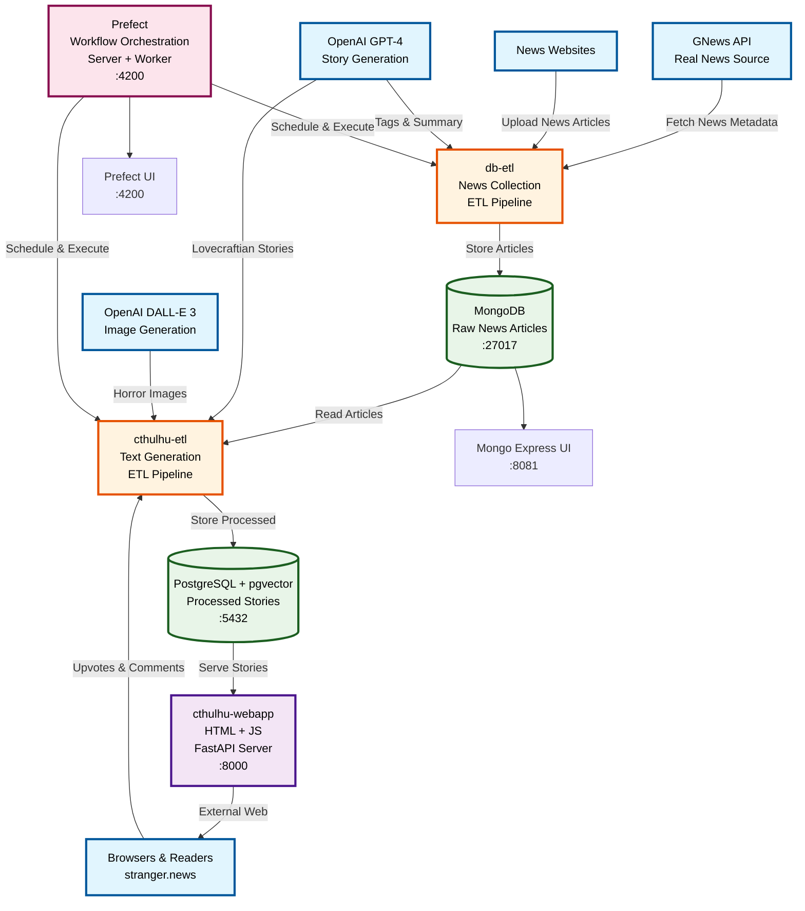
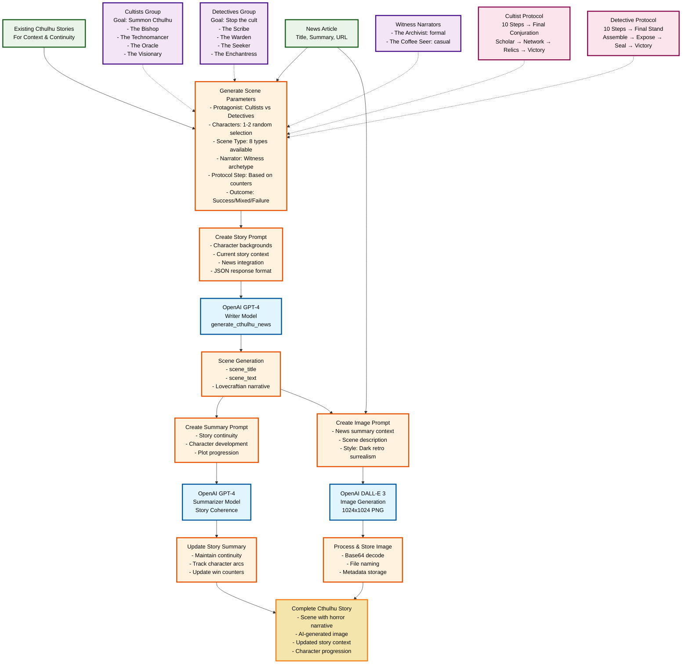

# Cthulhu News Architecture

## Architecture Overview

### 3-Tier Microservices Architecture

**Presentation Tier**
- `web-page`: FastAPI web server serving the horror news interface
- Jinja2 templates with custom horror-themed styling

**Business Logic Tier**  
- `web-etl`: Transforms news articles into Lovecraftian stories using OpenAI
- `db-etl`: Collects and preprocesses news articles from GNews API
- Prefect orchestrates and schedules ETL workflows

**Data Tier**
- MongoDB: Stores raw news articles and metadata
- PostgreSQL + pgvector: Stores processed stories with vector embeddings
- mongo-express: Database administration interface

### Data Flow

1. **Collection**: `db-etl` fetches news from GNews API → stores in MongoDB
2. **Processing**: `web-etl` reads articles → generates Cthulhu stories via OpenAI → stores in PostgreSQL  
3. **Presentation**: `web-page` serves processed stories through horror-themed web interface
4. **Orchestration**: Prefect manages workflow scheduling and execution

### Key Technologies
- **Containerization**: Docker Compose orchestrates all services
- **AI Integration**: OpenAI GPT-4 for story generation, DALL-E 3 for images
- **Vector Search**: pgvector enables semantic story similarity
- **Workflow Management**: Prefect handles ETL scheduling and monitoring

## LLM Workflow Pipeline (web/llm_cthulhu_new.py)

### LLM Workflow Features

**Multi-Stage Story Generation**
- **Character-Driven**: Alternates between Cultists vs Detectives protagonists
- **Structured Narrative**: 8 scene types (Exposition, Dialogue, Investigation, etc.)
- **Win Counter System**: Progressive 10-step protocols for each faction
- **Witness Narration**: Two distinct narrative voices (Archivist, Coffee Seer)

**Advanced Prompt Engineering**
- **Role-Based Prompting**: Distinct system roles for different AI tasks
- **Context Building**: Dynamic story history and character integration
- **JSON Response Format**: Structured output with field validation
- **Sample Templates**: Consistent Lovecraftian style examples

**Integrated Image Generation**
- **Contextual Prompts**: Combines news content with scene descriptions
- **Consistent Style**: "Dark retro surrealism" aesthetic
- **Metadata Tracking**: Comprehensive image generation logging
- **File Management**: Organized storage with sanitized naming

**Story Continuity System**
- **Ongoing Summary**: Maintained across all scenes for coherence
- **Character Development**: Consistent personality and background tracking
- **Plot Progression**: Win counters determine available protocol actions
- **Victory Conditions**: Story concludes when faction achieves final protocol